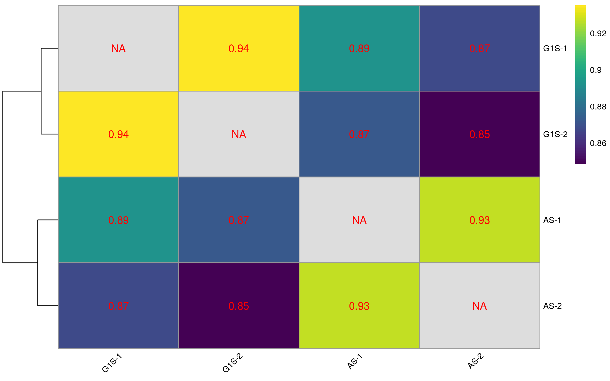
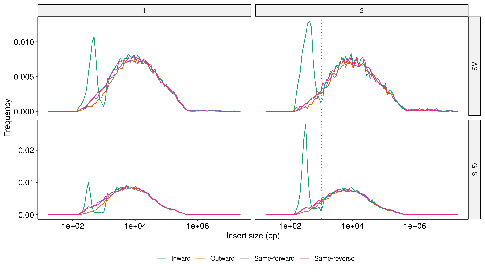
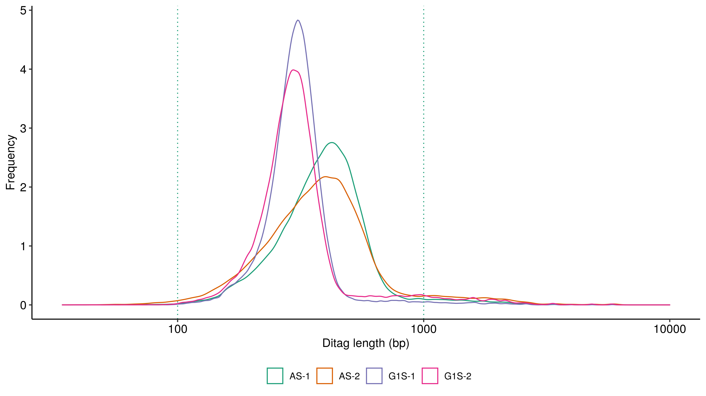

# HiCflow

## Comprehensive bioinformatics analysis pipeline for processing raw HiC read data to publication read HiC maps.

HiCflow aims to provide an accessible and user-friendly experience to analyse HiC data using a wide range of published tools.
The pipeline utilises the workflow management system Snakemake and automatically handles installation of all required software with no user input. HiCflow can also be easily scaled to work in cluster environments. Current software utilised by HiCflow include:

 * [FastQC](https://www.bioinformatics.babraham.ac.uk/projects/fastqc/) - A quality control tool for high throughput sequence data.
 * [FastQ Screen](https://www.bioinformatics.babraham.ac.uk/projects/fastq_screen/) - A tool to screen for species composition in FASTQ sequences.
 * [Cutadapt](https://cutadapt.readthedocs.io/en/stable/) - A tool to remove adapter sequences, primers, poly-A tails and others from high-throughput sequencing reads.
 * [HiCUP](https://www.bioinformatics.babraham.ac.uk/projects/hicup/) - A tool for mapping and performing quality control on Hi-C data.
 * [HiCExplorer](https://hicexplorer.readthedocs.io/en/latest/) - A set of tools for building, normalising and processing HiC matrices.
 * [OnTAD](https://github.com/anlin00007/OnTAD) - An optimised nested TAD caller for identifying hierarchical TADs in HiC data.
 * [HiCRep](https://genome.cshlp.org/content/early/2017/08/30/gr.220640.117) - A tool for assessing the reproducibility of Hi-C data using a stratum-adjusted correlation coefficient.
 * [HiCcompare](https://bmcbioinformatics.biomedcentral.com/articles/10.1186/s12859-018-2288-x) - A tool joint normalisation and comparison of HI-C datasets
 * [pyGenomeTracks](https://github.com/deeptools/pyGenomeTracks) - A tool for plotting customisable, publication ready genome tracks including HiC maps.
 * [MultiQC](https://multiqc.info/) - Aggregate results from bioinformatics analyses across many samples into a single report.

## Table of contents

  * [Installation](#installation)
  * [Configuration](#configuration)
  * [Usage](#usage)
  * [Example output](#example-output)
     * [HiC track](#hic-track)
     * [HiCcompare track](#hiccompare-track)
     * [UCSC browser](#ucsc-browser)
  * [Quality Control](#quality-control)
     * [HiCRep](#hicrep)
     * [MultiQC report](#multiqc-report)
     * [Other QC metrics](#custom-qc-metrics)

## Installation

HiCflow works with python >=3.6 and requires [Snakemake](https://snakemake.readthedocs.io/en/stable/getting_started/installation.html).

The HiCflow repository can be downloaded from github as follows:

```bash
$ git clone https://github.com/StephenRicher/HiC-pipeline.git
```

## Configuration

Add configuration

## Usage

Add usage.

## Example output

### HiC track

HiCflow utilises pyGenomeTracks to plot annotated HiC tracks with nested TAD domains, loops and TAD insulation scores. ChIP data and orientation of CTCF sites can also be provided.


### HiCcompare track

HiCflow uses HiCcompare to produce joint normalised Z-score subtraction matrices between pairs of samples. Statistically significant changes are highlighted as points on the subtraction matrix.


### UCSC browser

Add example

## Quality Control

### MultiQC report

HiCflow utilises MultiQC to aggregate the QC and metric report across all samples and all compatible tools used in the pipeline. An example MultiQC report produced by HiCflow is shown [here](./README_files/multiqc_report.html).  

### HiCRep

HiCflow uses HiCRep to assess sample-reproducibility by calculating the stratum-adjusted correlation coefficient between all pairwise samples.


### Other QC Metrics

#### Insert Size Distribution


#### Ditag Length

