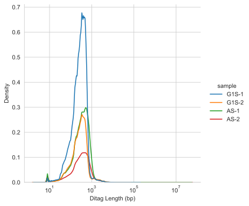

# HiCflow

## Comprehensive bioinformatics analysis pipeline for processing raw HiC read data to publication read HiC maps.

HiCflow aims to provide an accessible and user-friendly experience to analyse HiC data using a wide range of published tools.
The pipeline utilises the workflow management system Snakemake and automatically handles the installation of all required software with no user input. HiCflow can also be easily scaled to work in cluster environments. Current software utilised by HiCflow includes:

 * [FastQC](https://www.bioinformatics.babraham.ac.uk/projects/fastqc/) - A quality control tool for high throughput sequence data.
 * [FastQ Screen](https://www.bioinformatics.babraham.ac.uk/projects/fastq_screen/) - A tool to screen for species composition in FASTQ sequences.
 * [Cutadapt](https://cutadapt.readthedocs.io/en/stable/) - A tool to remove adapter sequences, primers, poly-A tails and others from high-throughput sequencing reads.
 * [HiCUP](https://www.bioinformatics.babraham.ac.uk/projects/hicup/) - A tool for mapping and performing quality control on Hi-C data.
 * [HiCExplorer](https://hicexplorer.readthedocs.io/en/latest/) - A set of tools for building, normalising and processing HiC matrices.
 * [OnTAD](https://github.com/anlin00007/OnTAD) - An optimised nested TAD caller for identifying hierarchical TADs in HiC data.
 * [HiCRep](https://genome.cshlp.org/content/early/2017/08/30/gr.220640.117) - A tool for assessing the reproducibility of Hi-C data using a stratum-adjusted correlation coefficient.
 * [HiCcompare](https://bmcbioinformatics.biomedcentral.com/articles/10.1186/s12859-018-2288-x) - A tool for joint normalisation and comparison of HI-C datasets
 * [pyGenomeTracks](https://github.com/deeptools/pyGenomeTracks) - A tool for plotting customisable, publication-ready genome tracks including HiC maps.
 * [MultiQC](https://multiqc.info/) - Aggregate results from bioinformatics analyses across many samples into a single report.

## Table of contents

  * [Installation](#installation)
  * [Configuration](#configuration)
  * [Usage](#usage)
  * [Example output](#example-output)
     * [HiC track](#hic-track)
     * [HiCcompare track](#hiccompare-track)
     * [Viewpoints](#viewpoints)
  * [Quality Control](#quality-control)
     * [HiCRep](#hicrep)
     * [MultiQC report](#multiqc-report)
     * [Other QC metrics](#custom-qc-metrics)
  * [References](#references)

## Installation

HiCflow works with python >=3.6 and requires [Snakemake](https://snakemake.readthedocs.io/en/stable/getting_started/installation.html).

The HiCflow repository can be downloaded from GitHub as follows:

```bash
git clone https://github.com/StephenRicher/HiCFlow.git
```

## Configuring HiCFlow

The HiCFlow pipeline is fully controlled through a single configuration file that describes parameter settings and paths to relevant files in the system.
HiCFlow is bundled with a fully configured small Hi-C dataset ([Wang et al., 2018](https://www.nature.com/articles/s41467-017-02526-9)) to test and serve as a template for configuring other datasets.
The configuration file for this example dataset is shown below and can be found at `example/config/config.yaml`.

**Note:** If relative file paths are provided in the configuration file, then these are **relative to the working directory**.
The working directory itself (defined by workdir) is relative to the directory ``snakemake`` is executed.
If not set, the working directory defaults to the directory containing the Snakefile.
Relative paths can be confusing; they are used here to ensure the example dataset works for all users.
If in doubt, simply provide absolute paths.

```bash
# Specify output directory - either an absolute path or relative to Snakefile.
# If using relative paths for subsequent files, these should be relative to
# this working directory.
workdir: example/analysis/

# CSV file with cell type, experimental group, replicate number,
# read (forward/reverse) and the path of each FASTQ file.
data:  ../config/samples.csv

# Bed file of genomic regions to perform HiC analysis.
# These may be whole chromosomes for normal HiC or specific capture regions
# for region capture HiC.
regions: ../config/regions.bed

# FASTA references to align data. Must specify a reference for each cell type
# defined in config['data'].
genome :
    S2Rplus : ../genome/BDGP6.28.fa.gz

build: BDGP6

# Set True to perform phasing and haplotype assembly pipeline.
phase: False
ASHIC: False

# Phased VCF file for allele-specific analysis. Must specify a VCF for each
# cell type defined in config['data']. If not set, then run normal HiC mode.
# The HiCFlow phasing pipeline (see above) outputs a phased VCF for each cell
# type which is valid input here.
phased_vcf:
    #S2Rplus : ../analysis/phasedVCFs/S2Rplus-phased.vcf

# List of bin sizes to analyse HiC data at different resolutions.
# The first bin size defines the base resolution; all subsequence bin sizes
# must be whole divisible by the base bin size, e.g. [1000, 1500] is invalid.
resolution:
    base : 1000
    bins : [1000, 3000]

# Parameters for Cutadapt - see https://cutadapt.readthedocs.io/en/stable/guide.html
cutadapt:
    forwardAdapter: AGATCGGAAGAGCACACGTCTGAACTCCAGTCA
    reverseAdapter: AGATCGGAAGAGCGTCGTGTAGGGAAAGAGTGT
    overlap: 6
    errorRate: 0.1
    minimumLength: 20
    qualityCutoff: 20
    GCcontent: 43


# List of restriction sequences in order of protocol usage. Cut site is denoted
# using the '^' symbol. Ensure restriction enzyme names are given as strings.
restrictionSeqs:
    A:
        DpnII : '^GATC'

HiCParams:
    minBins:              50
    minDistance:          300
    maxLibraryInsertSize: 1000
    minMappingQuality:    15
    removeSelfLigation:   True
    keepSelfCircles:      False
    skipDuplicationCheck: False
    nofill:               False
    threads:              4
    multiplicativeValue:  10000 # HiC counts are normalised to this value

plotParams:
    distanceNorm:   False # Plot obs/exp matrix instead of log counts.
    plain:          True # Plot additional figure without TAD/loop annotations
    colourmap:      Purples
    # BED file for creating plots of additional viewpoints in addition to those
    # defined config['protocol']['regions'].
    coordinates:    ../config/plot_coordinates.bed
    viewpoints:     ../config/viewpoints.bed
    viewpointRange: 150_000
    plotRep:        True
    vLines:         ../config/vlines.bed
    runPCA:         True

# Bigwig tracks for plotting below HiC plots.
bigWig :
    CP190 : ../genome/CP190-dm6.bw    # GSM762836
    Beaf-32 : ../genome/Beaf32-dm6.bw # GSM762845
    CTCF : ../genome/CTCF-dm6.bw      # GSM1535983
# BED tracks for plotting with HiC plots.
bed :
    Genes : ../genome/BDGP6.28.99.genes.bed

compareMatrices:
    minZ:  2    # Z-score threshold for defining a HiCcompare 'peak'.
    vMin: -2 # Mimimum logFC value for colour scale.
    vMax: 2  # Maximum logFC value for colour scale.
    size: 3     # Size of median filter to denoise comparison matrix.
    allPairs: False # If True run '1 vs 2' AND '2 vs 1'
    simpleSubtract: True

# GATK variant calling best practises for human data
gatk:
    hapmap:     #'gatkResourceBundle/hapmap_3.3.hg38.vcf.gz'
    omni:       #'gatkResourceBundle/1000G_omni2.5.hg38.vcf.gz'
    G1K:        #'gatkResourceBundle/1000G_phase1.snps.high_confidence.hg38.vcf.gz'
    dbsnp:      #'gatkResourceBundle/dbsnp_146.hg38.vcf.gz'
    mills:      #'gatkResourceBundle/Mills_and_1000G_gold_standard.indels.hg38.vcf.gz'
    all_known:  #['gatkResourceBundle/dbsnp_146.hg38.vcf.gz',
                #'gatkResourceBundle/1000G_phase1.snps.high_confidence.hg38.vcf.gz',
                #'gatkResourceBundle/Mills_and_1000G_gold_standard.indels.hg38.vcf.gz']
    trustPoly:  True
    downSample: 42.1 # Optionally downsample reads for baseRecalibrator

# Optional run HiCRep - may take a while for high res datasets.
runHiCRep: True

# Treat data as microC - ignore restriction digest.
microC: False

# Skip FASTQ truncation and perform local alignment instead
localAlignment: False

# Write TAD and HiCcompare status and score to a binned pandas
rescalePKL: True

# Output a BAM file containing only valid HiC read pairs within defined regions.
createValidBam: False

# Configuration file for customising multiQC output report.
multiQCconfig : ../config/multiqc_config.yaml

# Configuration file of paths to genome indexes for FastQ Screen.
# See template in example/config/fastq_screen.config
fastq_screen :
```

## Usage

Once Snakemake is installed, the example dataset can be processed using the following command.
This command should be run from the HiCFlow base directory containing the Snakefile.

```bash
snakemake --use-conda --cores 4 --configfile example/config/config.yaml
```

This command will first install all relevant Conda environments within the defined working directory (`example/analysis/`); this may take some time.
The pipeline should then run to completion producing the exact figures as shown in the example output below.
Alternatively, you may also want to install the Conda environments in a custom directory.
A custom directory is helpful if you perform multiple independent analyses and do not want to install the same Conda environments repeatedly.

```bash
snakemake --use-conda --conda-prefix /path/envs/ --cores 4 --configfile example/config/config.yaml
```

### Cluster Execution
All Snakemake-based pipelines, including HiCFlow, are compatible with cluster environments.
Consult the official Snakemake documentation [here](https://snakemake.readthedocs.io/en/v5.25.0/executing/cli.html#profiles) to learn more about running HiCFlow on your particular cluster environment.


## Example output

### HiC track

HiCflow utilises pyGenomeTracks to plot annotated HiC tracks with nested TAD domains, loops and TAD insulation scores. In addition, custom BED and Bedgraph files can be provided through the configuration file.


### HiCcompare track

HiCflow uses HiCcompare to produce joint normalised log fold-change subtraction matrices between pairs of samples.


### Viewpoints

HiCFlow can also plot custom viewpoints of specific regions. Viewpoint regions must be provided as a BED file in the configuration file under plotParams -> viewpoints. The below example compares two samples using between-sample normalised contact frequencies provided by HiCcompare.


## Quality Control

### MultiQC report

HiCflow utilises MultiQC to aggregate the QC and metric report across all samples and all compatible tools used in the pipeline. An example MultiQC report produced by HiCflow is shown [here](./README_files/multiqc_report.html).  

### HiCRep

HiCflow uses HiCRep to assess sample reproducibility by calculating the stratum-adjusted correlation coefficient between all pairwise samples.


### Other QC Metrics

#### Insert Size Distribution


#### Ditag Length


## References
Qi Wang, Qiu Sun, Daniel M. Czajkowsky, and Zhifeng Shao. Sub-kb Hi-C in D.
melanogaster reveals conserved characteristics of TADs between insect and mammalian
cells. Nature Communications, 2018. ISSN 20411723. doi: 10.1038/s41467-017-02526-9.
